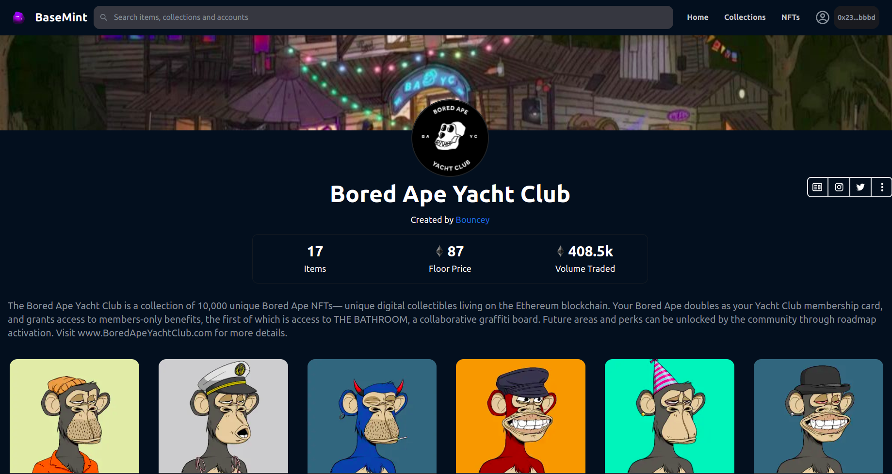
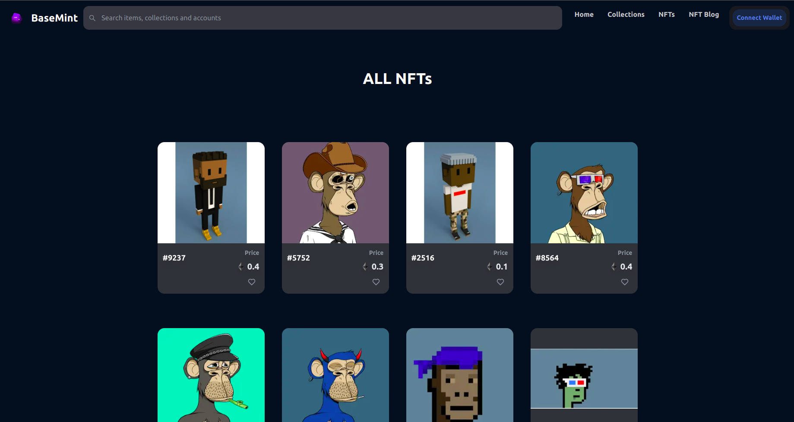

# Nft Marketplace
<!-- ALL-CONTRIBUTORS-BADGE:START - Do not remove or modify this section -->
<!--  -->
<!-- ALL-CONTRIBUTORS-BADGE:END -->
A Web3.0 Block-chain application to discover, collect, and sell extraordinary NFTs. The Decentralized application was built on the Ethereum Blockchain with Nextjs, and Smart contracts written in Solidity.

> ## ⭐ Show Your Support
> If you like this project, do not forget to give ⭐s. So it can get more attention and get more support from the community. Don't underestimate one star, one star you give will convince others to give the project another star.

<!-- 
## 💪 Motivation

I aim to create an open and safe nft marketplace for everyone. This will be a challenge for both me and the contributors. Together we will create an open source, reliable and beautiful nft marketplace example. The purpose of this project is not to operate an nft marketplace, but to create a template for nft marketplaces. Thus, many nft marketplaces can be easily created by forking and modifying this template. This will be beneficial for us to support the artists. We can only succeed in the world by coming from different areas and joining our forces.

 -->

## 🔧 Technology Stack & Tools

Solidity(Writing Smart Contracts)
  
- [BaseMint Blog](https://baseminty.com/blog)

- [Ethers](https://docs.ethers.io/)
 

- [Hardhat](https://hardhat.org/)
 

- [Sanity.io](https://www.sanity.io/)

## 🖥️ Screenshoots 

### Home

 
 

### Explore

<!-- 
 -->

  
&nbsp; &nbsp; &nbsp; &nbsp;
  

 
 

### Nft Detail
<!--    -->

  
&nbsp; &nbsp; &nbsp; &nbsp;
  

## 🎉 Roadmap

 - [x] Base Components of the Project 
 - [x] Search Filters for Explore Page
 - [x] Connect Wallet (ETH Wallets 🚀)
 - [x] NFT Collections Page
 - [x] NFT Detail Page
 - [x] Smartcontract Backend (Truffle)
 - [x] Blog Page
 - [x] Login
 - [x] User's Profile Page
 - [x] User Collections
 - [x] Connect Wallet Popup
 - [x] Supported Mobile Devices
## 🗞️ Blog
Everything and anything you need to know about Web3, NFTs, Decentralized apps and games.
 - [BaseMint Blog](https://baseminty.com/blog)

  

## 🔮 Usage
To use this application as your own, follow these simple steps:
<!-- 
>- 
>- 
>-  -->
<ul>
<li>

Fork this Repository (`git clone https://github.com/bouncei/b-blockchain-nft.git`)

</li>
<li>

Install Dependecies (`yarn install`)

</li>
<li>

Run Project (`yarn start`)

</li>

</ul>

<!-- # `yarn install (for first running)`
# `yarn dev` -->

<!--  -->

<!--  -->

<!-- ### Show Your Support
Give a  -->

## 🤝 Contribute
Contributions are what make the open source community such an amazing place to be learn, inspire, and create. Any contributions you make are <strong>greatly appreciated</strong>. 😊

&emsp;1. Fork Project

&emsp;2. Create your Feature Branch (`git checkout -b feature/AmazingFeature`)

&emsp;3. Commit your changes(`git commit -m "Add Some Amazing Feature" `)

&emsp;4. Push to the Branch (`git push origin feature/AmazingFeature`)

&emsp;5. Open a Pull Request

 
 
 

## 📞 Contact
 - [LinkedIn](https://www.linkedin.com/in/joshua-inyang-2753841b7/) 
  

 - [My Website](https://www.bouncei.herokuapp.com)
  

- [twitter ](https://twitter.com/InyangJoshua8)